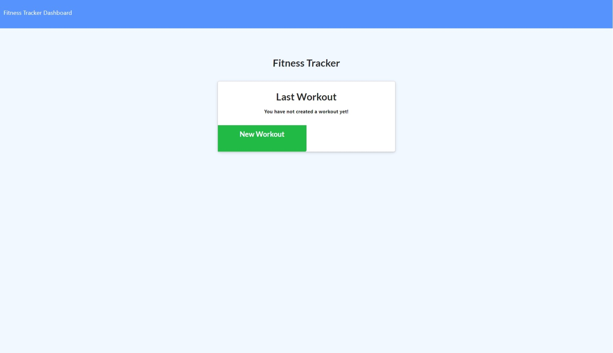
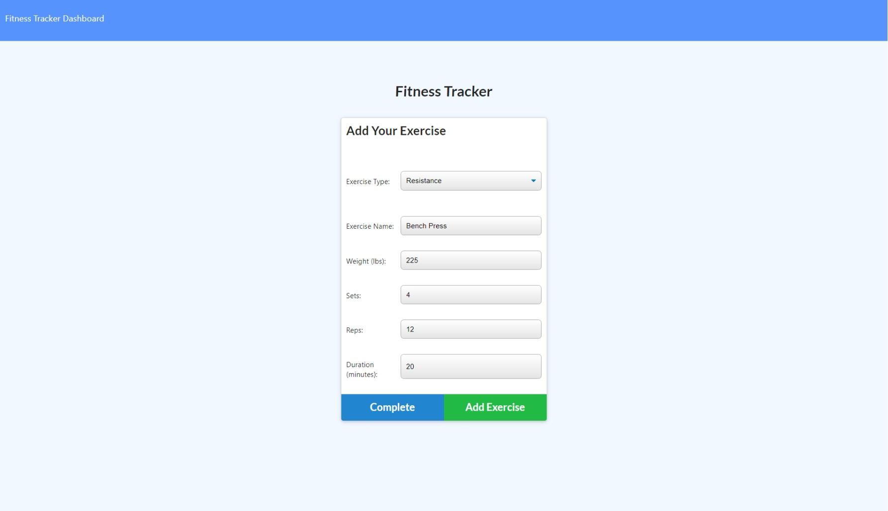
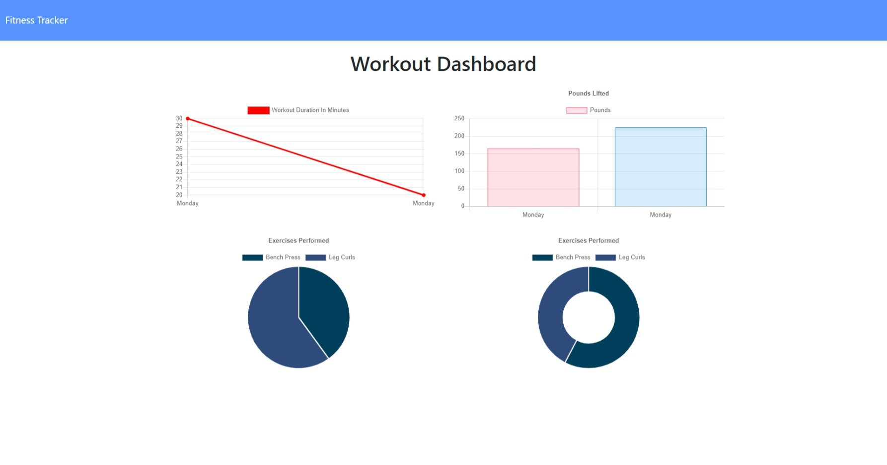
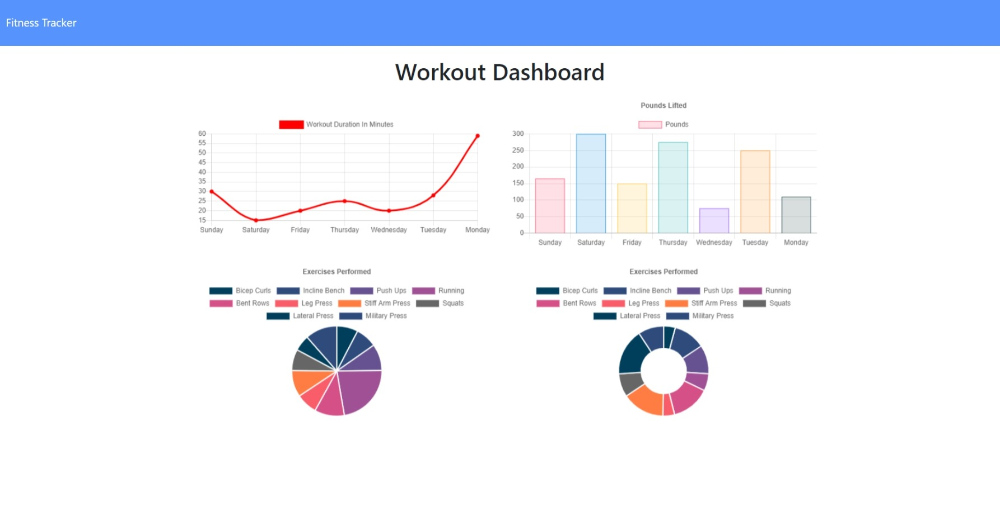

# Assignment 17:  Fitness Tracker

  

***

  ## Description:
  This is an application that allows a user to input exercises for a resistance or cardio workout.  Persistence storage is used to save the workout with a NoSQL database.  MongoDb is the database structure with the use of Mongoose for ease of use.  A middleware module called Morgan is used for as an entry logger that displays critical information for debugging or general monitoring.    
   
***
  ## Table of Contents:
  1.  [Description](#description)
  2.  [Demonstration](#demonstration)
  3.  [Installation](#installation)
  4.  [Screenshots](#screenshots)
  5.  [Technologies](#technologies)
  6.  [Usage](#usage)
  7.  [License](#license)
  8.  [Contributing](#contributing)
  9.  [Tests](#tests)
  10.  [Questions](#questions)

***
  ## Demonstration:
  [Deployed website link](https://rocky-plateau-46275.herokuapp.com/stats)

***
  ## Installation:
  To use this application, the user can fork or clone.  Then run `npm install`. See the technologies section for the application dependencies.  In addition, the user will need to connect to an active or local Mongo database server for full functionality.  However, any users may freely use this deployed application at the above deploy application website.

***
  ## Screenshots:
  ### (Deployed Application)
  

  ### (Enter Exercise)
  

  ### (Two Workouts)
  

  ### (Full Workouts)
  

***
  ## Technologies
    - Node.js
    - Express.js
    - MongoDB
    - Mongoose
    - Javascript
    - Dotenv
    - Morgan
    - Bootstrap 

  ## Usage:
  This application utilizes several web and database technologies that allows a user to enter workout exercises to a database, complete a workout that is started, or start a new workout.  MongoDB Atlas is used to store the exercises and workouts in the database.  There is a graph that depicts the duration of the workouts and an addition graph that displays amount of cuminative weight that has been lifted.  There are pie charts on the bottom that gives a visual presentation of the exercises completed. The Morgan logger module is used to monitor user request and responses.   
   
***
  ## License:
  This project falls under the MIT License.  The full documentation for this license can be found at [MIT Full Documentation](https://choosealicense.com/licenses/mit).

  Below is an excerpt of the MIT License.
   
  Copyright <YEAR> <COPYRIGHT HOLDER>
    
    Permission is hereby granted, free of charge, to any person obtaining a copy of this software and associated documentation files (the "Software"), to deal in the Software without restriction, including without limitation the rights to use, copy, modify, merge, publish, distribute, sublicense, and/or sell copies of the Software, and to permit persons to whom the Software is furnished to do so, subject to the following conditions:
    The above copyright notice and this permission notice shall be included in all copies or substantial portions of the Software.
    THE SOFTWARE IS PROVIDED "AS IS", WITHOUT WARRANTY OF ANY KIND, EXPRESS OR IMPLIED, INCLUDING BUT NOT LIMITED TO THE WARRANTIES OF MERCHANTABILITY, FITNESS FOR A PARTICULAR PURPOSE AND NONINFRINGEMENT. IN NO EVENT SHALL THE AUTHORS OR COPYRIGHT HOLDERS BE LIABLE FOR ANY CLAIM, DAMAGES OR OTHER LIABILITY, WHETHER IN AN ACTION OF CONTRACT, TORT OR OTHERWISE, ARISING FROM, OUT OF OR IN CONNECTION WITH THE SOFTWARE OR THE USE OR OTHER DEALINGS IN THE SOFTWARE.

  ## Contributing:
  To contribute to this project, please send an email.  
   
  The contributors for this project are:
    - D. Javan Worthy

***
  ## Tests:
  There are some test for this application.  The data/communication routes must be verified before this application can be properly deployed.  In addition, there must be an operational database and it must be connected to the application to receive the full functionality.  

***
  ## Questions:
  - The GitHub profiles for this project are:
   - https://github.com/djavanw
 
  - If there are any questions, please contact Alex at emailfake@gmail.com.